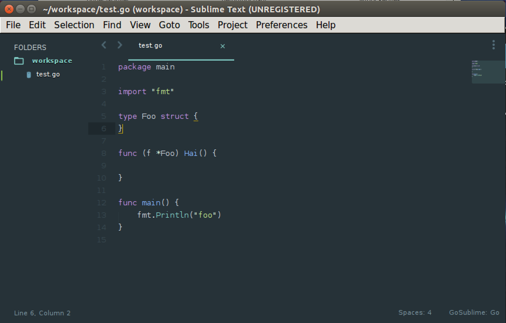

# Sublime Text 3 for Go
Get started quickly with this docker container of Sublime Text 3 prepared for Golang development.  
Came up with this idea for shortening newcomers on-boarding time.



### Getting started
First pull the container.
```bash
docker pull jgautheron/sublime-text-go:latest
```

Then run it!
```bash
docker run -it \
   -v $HOME/.config/sublime-text-3/:/home/subl/.config/sublime-text-3 \
   # path to your workspace
   -v $HOME/workspace:/home/subl/workspace \
   -v /tmp/.X11-unix:/tmp/.X11-unix \
   # mount your own GOPATH if you want
   # -v /root/go:/home/subl/go \
   -e DISPLAY=$DISPLAY \ 
   jgautheron/sublime-text-go:latest
```

### What is inside?
This version contains two plugins:
- GoSublime
- Material Theme

ST is configured to run automatically at each save:
- `goimports`
- `go build`
- `go test`
- `go vet`
- `golint`

### Troubleshooting

`# 'Gtk: cannot open display: :0'`  
Try to set `DISPLAY=your_host_ip:0` or run `xhost +` on your host.  
[Read here](http://stackoverflow.com/questions/28392949/running-chromium-inside-docker-gtk-cannot-open-display-0) for more info.
